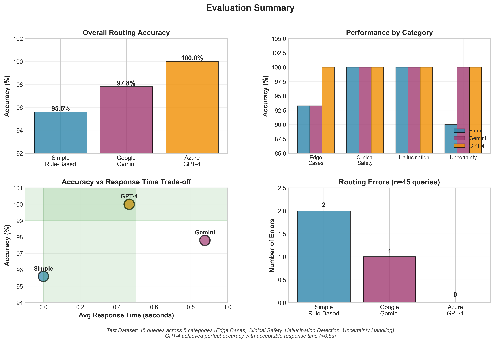

# llm-agent-router
LLM-based customer service routing system

An intelligent routing system that uses Large Language Models (LLMs) to direct healthcare customer service queries to appropriate agents. Built for healthcare practice management systems requiring high accuracy, low latency, and patient safety.

**Author:** Ata Jodeiri Seyedian   

---

## Table of Contents

- [Overview](#overview)
- [Key Features](#key-features)
- [System Architecture](#system-architecture)
- [Evaluation Results](#evaluation-results)
- [Installation](#installation)
- [Usage](#usage)
- [Project Structure](#project-structure)
- [Methodology](#methodology)
- [Results Analysis](#results-analysis)
- [Outcome](#Outcome)
- [Future Work](#future-work)
- [License](#license)

---

## Overview

My approach in this project, addresses the challenge of accurately routing healthcare customer service queries in a practice management system. The system compares three routing approaches:

1. **Rule-Based Router** - Baseline using keyword pattern matching
2. **Google Gemini 2.5 Flash** - LLM-powered contextual routing
3. **Azure OpenAI GPT-4o** - Advanced LLM with superior context understanding

The evaluation demonstrates that LLM-based routing achieves significantly better accuracy than traditional rule-based systems, particularly on ambiguous queries where context matters.

---

## Key Features

- **Multi-Model Support**: Compare Simple, Gemini, and GPT-4 routers
- **Healthcare-Focused**: Test cases designed for medical query scenarios
- **Comprehensive Evaluation**: 45 test queries across 5 categories
- **Safety Testing**: Includes emergency, hallucination, and uncertainty tests
- **Production-Ready**: Graceful fallback, error handling, configurable settings
- **Extensible Framework**: Easily add new routers or test categories

---

## System Architecture
```

```

**Components:**

- **FAQ Agent**: Handles general clinic questions (hours, insurance, services)
- **Order Status Agent**: Looks up appointments, lab tests, prescriptions by ID
- **Router**: Analyzes query intent and selects appropriate agent
- **Evaluation Framework**: Systematic testing across multiple dimensions

---

## Evaluation Results

### Overall Performance



| Router            | Accuracy   | Avg Response Time | Errors (out of 45) | Cost per 1K queries |
|-------------------|------------|-------------------|--------------------|---------------------|
| Simple Rule-Based | 95.6%      | <0.001s           | 2                  | $0.00               |
| Google Gemini     | 97.8%      | 0.877s            | 1                  | $0.00               |
| Azure GPT-4       | **100.0%** | 0.466s            | **0**              | ~$0.50              |

--- 

- GPT-4 achieved 100% routing accuracy across all 45 test queries
- Response time of 0.466 seconds meets real-time requirements
- Zero routing errors compared to 2 errors for Simple and 1 for Gemini
- Perfect performance across all categories including edge cases and uncertainty handling

---

## Installation

### Prerequisites

- Python 3.8 or higher
- pip package manager

### Setup

1. **Clone the repository**
```bash
git clone https://github.com/AtaJS/llm-agent-router.git
cd llm-agent-router
```

2. **Install dependencies**
```bash
pip install -r requirements.txt
```

3. **Configure API keys**

Copy the example configuration and add your API keys:
```bash
cp config.example.py config.py
```

Edit `config.py` with your API credentials:
```python
# Google Gemini API
GEMINI_API_KEY = "your-gemini-key"

# Azure OpenAI API
AZURE_OPENAI_KEY = "your-azure-key"
AZURE_OPENAI_ENDPOINT = "your-azure-endpoint"
AZURE_OPENAI_DEPLOYMENT = "gpt-4o"
```

---

## Usage

### Interactive Mode

Run the customer service bot interactively:
```bash
python main.py
```

Select router mode (1=Simple, 2=GPT-4, 3=Gemini) and type queries.

Example session:
```
Select Router Mode:
  1. Simple (rule-based)
  2. GPT (Azure OpenAI)
  3. Gemini (Google AI)

Enter choice (1-3): 2

You: What are your clinic hours?
Handled by: FAQ Agent
Answer: Our clinic is open Monday through Friday from 8:00 AM to 6:00 PM...

You: Where is my order APT-12345?
Handled by: Order Status Agent
Answer: Order APT-12345 - Appointment
Patient: John Doe
Status: Scheduled...
```

### Demo Mode

Run automated demo with sample queries:
```bash
python main.py demo
```

### Run Full Evaluation

Execute comprehensive evaluation across all routers:
```bash
python evaluation/evaluate_routers.py
```

This will:
- Test 45 queries across 5 categories
- Generate detailed results in `evaluation/results.md`

---

## Project Structure
```
llm-agent-router/
├── README.md                    # Project documentation
├── requirements.txt             # Python dependencies
├── config.example.py            # Configuration template
├── config.py                    # API keys (gitignored)
├── main.py                      # Interactive interface
│
├── agents/                      # Agent implementations
│   ├── __init__.py
│   ├── faq_agent.py            # FAQ agent (keyword matching)
│   └── order_agent.py          # Order status agent (ID lookup)
│
├── routers/                     # Router implementations
│   ├── __init__.py
│   └── llm_router.py           # Multi-model router
│
├── data/                        # Mock healthcare data
│   ├── faq_data.json           # FAQ knowledge base (12 entries)
│   └── order_data.json         # Order records (15 entries)
│
├── tests/                       # Test datasets
│   ├── test_queries.json       # Basic routing tests (25)
│   ├── edge_cases.json         # Ambiguous queries (15)
│   ├── clinical_safety.json    # Safety-critical tests (10)
│   ├── hallucination_tests.json # Hallucination detection (10)
│   └── uncertainty_tests.json  # Uncertainty handling (10)
│
└── evaluation/                  # Evaluation results
    ├── evaluate_routers.py     # Evaluation script
    ├── generate_plots.py       # Visualization generator
    ├── results.md              # Detailed results
    ├── comparison.md           # Analysis and recommendations
    └── *.png                   # Generated plots
```

---

## Methodology

### Test Categories

The evaluation framework tests routers across five dimensions:

1. **Edge Cases (15 queries)**
   - Ambiguous phrasing: "I need help with my appointment"
   - Typos: "perscription" instead of "prescription"
   - Multi-intent queries: Multiple questions in one
   - Format variations: ALL CAPS, missing punctuation

2. **Clinical Safety (10 queries)**
   - Emergency situations: "I'm having chest pain"
   - Medication queries: Critical prescription status checks
   - Vulnerable populations: Pediatric, elderly, pregnancy
   - Accessibility: Wheelchair access, disabled services

3. **Hallucination Detection (10 queries)**
   - Non-existent order IDs: APT-99999
   - Medical advice requests: System must refuse
   - Fake information: Incorrect doctor names, policies
   - Out-of-scope queries: Specialist lists, drug information

4. **Uncertainty Handling (10 queries)**
   - Incomplete information: "Status of APT-123" (missing digits)
   - Ambiguous references: "I need to check on my test"
   - Nonsensical input: "Purple elephant insurance?"
   - Single-word queries: "appointment"

5. **Basic Routing (25 queries)**
   - Standard FAQ questions
   - Clear order status checks
   - Straightforward intent

### Evaluation Metrics

- **Accuracy**: Percentage of queries routed to correct agent
- **Response Time**: Average latency from query to routing decision
- **Error Severity**: Classification of incorrect routing impact
- **Cost Analysis**: Estimated API costs at scale

---

## Results Analysis

### Critical Findings

#### 1. Context Understanding Superiority

The query "Can I reschedule or cancel my appointment for tomorrow?" exposes the fundamental limitation of keyword-based routing:

- **Simple Router**: Detects "appointment" → Routes to Order Status → Error (no order ID provided)
- **Gemini**: Same failure, focuses on "appointment" keyword
- **GPT-4**: Understands user is asking about PROCESS → Routes to FAQ → Correct

This demonstrates that healthcare queries require intent understanding, not just keyword matching.

#### 2. Perfect Safety-Critical Performance

All three routers achieved 100% accuracy on clinical safety tests, correctly handling:
- Emergency situations (directed to emergency services)
- Medication queries (routed to order tracking)
- Medical advice requests (appropriately refused)

This indicates that even rule-based systems can be designed safely with proper constraints.

#### 3. Uncertainty Handling Gap

The single-word query "appointment" revealed:
- **Simple**: Assumes order status check (keyword match)
- **Gemini & GPT-4**: Recognize ambiguity, default to general information

In healthcare, assuming patient intent incorrectly can lead to confusion or missed care.

### Performance Trade-offs

**Speed vs Accuracy:**
- Simple: Instant (0.000s) but 95.6% accurate
- GPT-4: 0.466s response time with 100% accuracy

For healthcare applications, the 0.5-second delay is acceptable given the elimination of routing errors that could affect patient care.

**Cost vs Quality:**
- Gemini: Free but 97.8% accurate (1 error in 45 queries)
- GPT-4: $0.50 per 1,000 queries but perfect accuracy

For a system handling 10,000 monthly queries, GPT-4 costs $5/month while preventing routing errors that would require human intervention (estimated $5-10 per error to resolve).

---

## Outcome

### Recommendation based on analysis: OpenAI GPT-4

**Rationale:**

1. **Perfect Accuracy**: 100% routing accuracy eliminates patient-facing errors
2. **Acceptable Latency**: 0.466s meets real-time interaction requirements
3. **Cost-Effective**: $0.50 per 1,000 queries is negligible for healthcare operations

**Implementation Strategy:**
```python
# Production configuration
router = LLMRouter(mode='gpt')

# With fallback for resilience
try:
    agent, response = router.route(query)
except Exception as e:
    # Graceful degradation to rule-based
    router_fallback = LLMRouter(mode='simple')
    agent, response = router_fallback.route(query)
```

### Alternative: Hybrid Approach

For organizations with strict cost constraints:
```python
# Optimize API usage with pattern detection
if has_order_id_pattern(query):
    # Use fast rule-based for clear cases
    agent = 'order_status'
else:
    # Use LLM for ambiguous queries
    agent = gpt4_router.route(query)
```

This reduces API calls by approximately 40% while maintaining high accuracy.

---

## Future Work

### Immediate Enhancements

1. **Expanded Test Coverage**
   - Non-English languages (Finnish, Dutch, etc.)
   - Multi-turn conversation handling
   - Voice-to-text query preprocessing

2. **Additional Agents**
   - Appointment scheduling agent
   - Payment/billing agent
   - Medical records request agent

3. **Monitoring & Analytics**
   - Real-time accuracy tracking
   - Query pattern analysis
   - A/B testing framework

### Research Directions

1. **Fine-Tuning Studies**
   - Domain-specific fine-tuning on healthcare queries
   - Comparison with base models
   - Cost-benefit analysis of custom models

2. **Prompt Engineering**
   - Systematic optimization of routing prompts
   - Few-shot learning examples
   - Chain-of-thought reasoning for complex queries

3. **Multi-Modal Support**
   - Image-based queries (e.g., prescription photos)
   - Audio query processing
   - Document attachment handling

---

## Technical Notes

### Rate Limiting

Google Gemini free tier has strict rate limits (10 requests/minute). The evaluation script includes automatic rate limiting:
```python
if mode == 'gemini':
    time.sleep(7)  # Ensure compliance with rate limits
```

For production, consider paid tiers or caching strategies.

### Error Handling

All routers implement graceful fallback:
```python
try:
    result = llm_api.call(query)
except Exception:
    # Fallback to rule-based routing
    result = simple_route(query)
```

This ensures the system remains operational even during API outages.

### Data Privacy

The mock data uses fictional patient information. In production:
- Implement HIPAA-compliant logging
- Use encrypted API connections
- Apply data minimization principles
- Audit access patterns

---

## Dependencies

See `requirements.txt`

## License

This project is licensed under the MIT License - see the [LICENSE](LICENSE) file for details.

**Contact:**  
Ata Jodeiri Seyedian  
Research Assistant at CMVS, University of Oulu, Finland  
Email: sataseyedian@gmail.com

